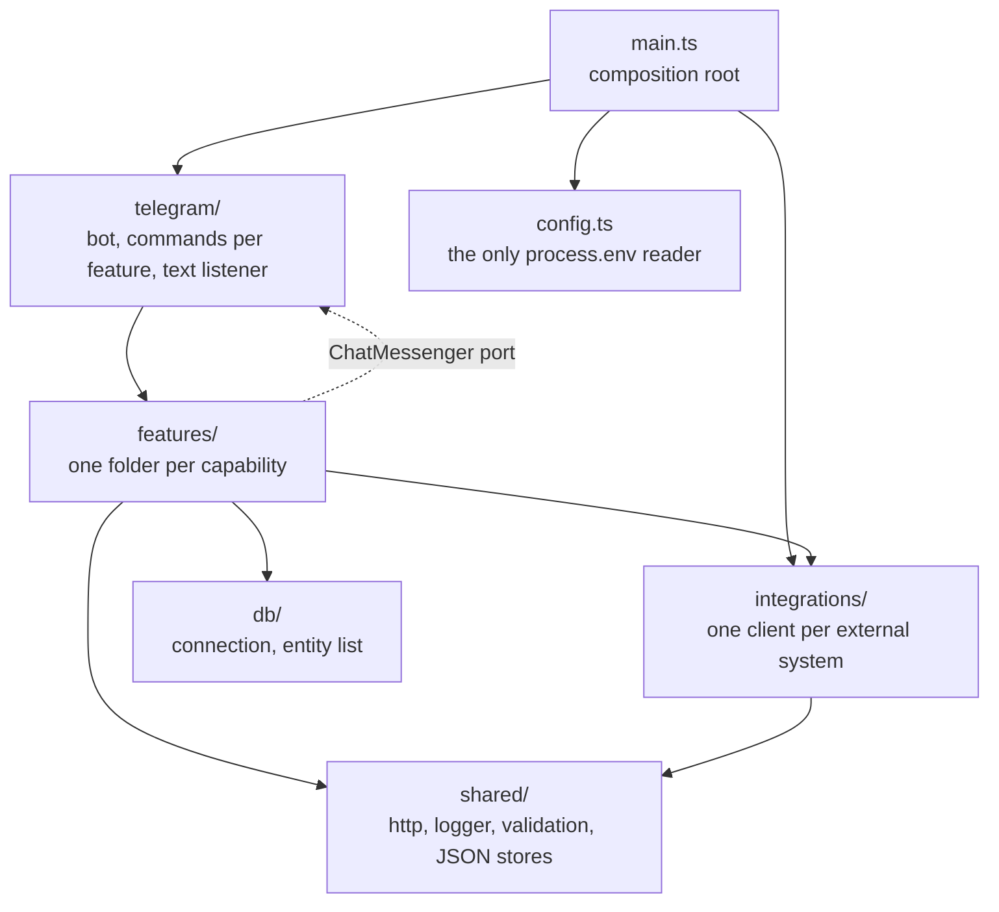
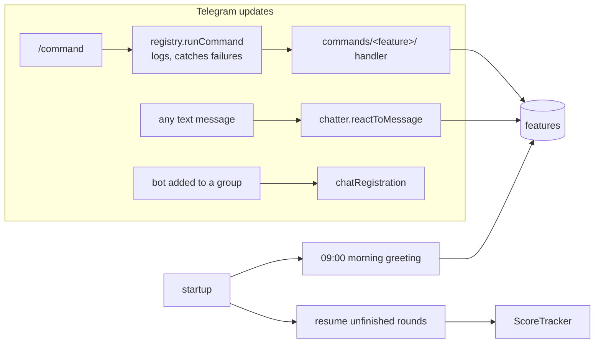

# Architecture

How sakariheitaja is put together: the layers, what each may import, and every way work
enters the bot. Two more pages go deeper:

- [`live-scoring.md`](live-scoring.md): a followed round from `/follow` to the round end
- [`data.md`](data.md): what is stored where, and which feature owns it

## Layers

The folder tells you the layer, and the layer tells you what it may import.

| Layer | Holds | May import |
| --- | --- | --- |
| `main.ts` | Builds the bot, every client and the `CommandDependencies`, registers the commands, starts the bot. | everything |
| `telegram/` | grammY: the bot, `commands/<feature>/` (a `command.ts` with the names and `/apua` help, a handler), the text listener, chat tracking, the Telegram `ChatMessenger`. | features (their `index.ts`), integrations (types), shared |
| `features/` | The application: live scoring, commentary, bagtags, players, score records, … Each table's entity and repository live in the owning feature's `db/` folder. A feature's `index.ts` is its public module: what other modules may use. | its own files, other features' `index.ts`, integrations, db, shared |
| `integrations/` | `createXClient(config)` for Metrix, OpenWeatherMap, Ollama, Challonge, Giphy and the recipe API. Clients own URLs, keys, timeouts, validation and normalization, and return normalized types or a result union. Each boundary's Zod schemas, with an example payload, live in a `schema.ts` next to the code that fetches it: the client, or for Metrix the endpoint folder (`round/`, `course/`, `location/`, `statistics/`). | shared |
| `db/` | The TypeORM data source and its entity list. | entities (`*.entity.ts`) |
| `shared/` | Generic helpers only. | shared |

The rules are ESLint errors (`eslint.config.mjs`), so CI fails on a violation:

- Nothing below `telegram/` imports it. Features send through the `ChatMessenger` port
  (`features/chatMessenger.ts`) that `main.ts` fills with the Telegram one.
- `integrations/` never imports `features/`, and `db/` imports only entities.
- A feature, `telegram/` and `main.ts` reach a feature only through its `index.ts`
  (`../bagtags`, not `../bagtags/messages`). A feature nobody outside uses has none.
- `fetch` and `shared/http` only in `integrations/`: features get clients injected.
- `process.env` only in `config.ts`.

Inside a module the layout is fixed where it can be: every feature has a
`README.md`, its tables in `db/`, and its tests (and fakes) in a `tests/` folder, as
does every other module. Reserved names like `route.ts`, `schema.ts`, `policy.ts`,
`prompts.ts` and `messages.ts` mean the same everywhere. The convention is
sakke-workspace `.agents/code-style.md`, "Folder structure". `src/tests/testLayout.test.ts`
fails if a test sits outside a `tests/` folder.

## Entry points

Work enters the bot in four ways. All of them start from `main.ts`.

1. **Commands.** `telegram/commands/registry.ts` registers every group from
   `buildCommandGroups`, in `/apua` order. `/apua` is generated from the same list, so a command
   with `help` shows up there automatically; `isit`, `heckle` and `aamuu` have none on purpose.
   The dev group (`/heckle`, `/aamuu`) exists only with `LLM_ENABLED=true`. Each command runs
   through `runCommand`, which logs it and catches its failure.
2. **The text listener**, registered last because it reacts to any text. It remembers the
   message for the heckler, answers when Sakari is named (match-play answer from Challonge
   and the model, else a heckle), and now and then replies to "jallu" or drops a random quote.
3. **Startup resume.** Every competition not marked done gets a new `ScoreTracker`, without a
   new player announcement.
4. **The morning greeting**, every day at 09:00 to `MORNING_CHAT_ID`, when it is set.

Joining a group (`message:new_chat_members`, `message:group_chat_created`) stores the chat.

## Where to start reading

| To change | Start at |
| --- | --- |
| a command or its `/apua` text | `src/telegram/commands/<feature>/command.ts` |
| following a round, the round end | `src/features/live-scoring/` ([README](../../src/features/live-scoring/README.md)) |
| commentary | `src/features/commentary/` ([README](../../src/features/commentary/README.md)) |
| what Metrix sends and how it's normalized | `src/integrations/metrix/` ([README](../../src/integrations/metrix/README.md)) |
| a prompt | `src/prompts/` |
| configuration | `src/config.ts` |
