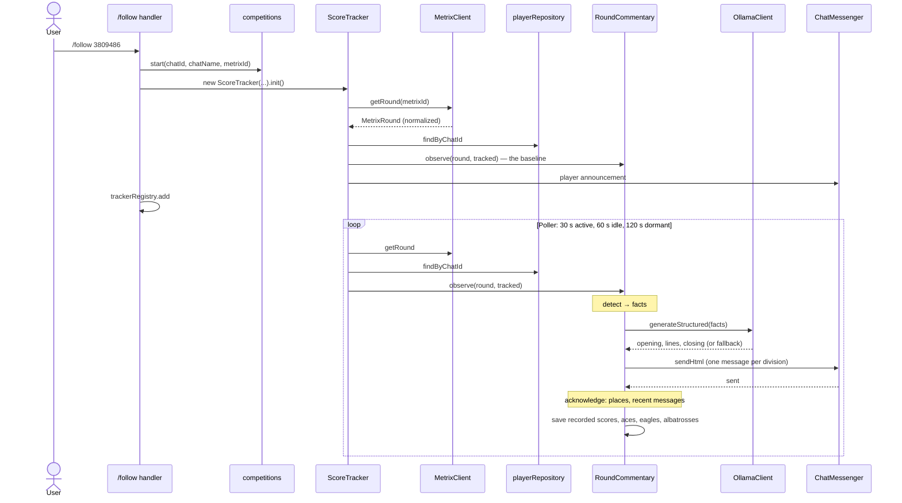

# Live scoring flow

One followed round, from `/follow` to the round end. The feature details are in
[`src/features/live-scoring/README.md`](../../src/features/live-scoring/README.md) and
[`src/features/commentary/README.md`](../../src/features/commentary/README.md); this page
shows how the pieces call each other.

## Following a round



- Polls are handled one at a time, in order. A failed request or an unusable payload is logged
  and skipped; the last good round stays.
- Course details, statistics and weather (`RoundCourseData`) are fetched with timeouts and never
  hold back a message.
- Only an acknowledged send moves the published places and the recent-message history forward.
  A failed send is logged, not retried.

## Round end

```mermaid
sequenceDiagram
    participant Tracker as ScoreTracker
    participant Commentary as RoundCommentary
    participant End as finishRound
    participant Db as score-records, competitions
    participant Json as bagtags, player-profiles
    participant Messenger as ChatMessenger

    Note over Tracker: every tracked player finished or DNF
    Tracker->>Tracker: stop polling
    Tracker->>Commentary: idle() — the last message goes out first
    Tracker->>End: finishRound(round, tracked)
    End->>Messenger: end message
    End->>Db: course, final results
    End->>Json: profiles, bagtag swaps
    End->>Db: competition marked done
    End->>Messenger: TOP-5 (with ratings)
    End->>Messenger: bagtag announcement
```

The competition is marked done only after everything is saved. If a step before it fails, the
round stays unfinished and the round end runs again after a restart; those steps are safe to
repeat. The TOP-5 and bagtag messages after it are best effort.

## `/lopeta`, restarts

- `/lopeta <metrixId>` stops the tracker and deletes the competition.
- A restart loses the in-memory state. `main.ts` resumes each unfinished competition with a
  fresh tracker that takes the current scorecards as its baseline: nothing is replayed, and no
  movement is claimed against the old ranking.
