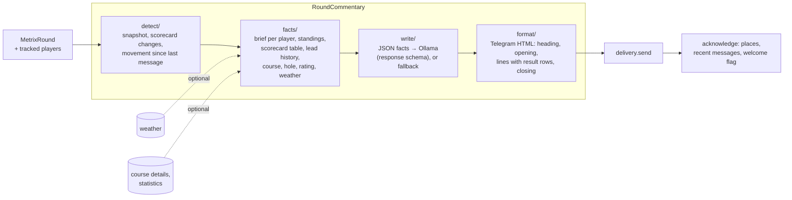

# Commentary

Turns each poll's score changes into one Telegram message per division. **Code computes every
fact; the model only writes the words.** The ScoreTracker (`../live-scoring/`) calls
`RoundCommentary.observe` after every poll, and commentary reaches the chat through the
`CommentaryDelivery` it was given.

## Stages

| Stage | Files | Does |
| --- | --- | --- |
| coordinate | `roundCommentary.ts` | Queues observations in order. Groups updates by division. Loads weather and course data with timeouts (they never hold back a message). Sends, then acknowledges only what was delivered. |
| detect | `detect/` | `commentarySnapshot`: what is remembered of a player. `scorecardChanges`: recorded / corrected / removed holes. `standingMovement`: place now against the last delivered message. |
| facts | `facts/` | Pure builders of everything the model may say. `commentaryContext.ts` assembles them into the model's input (`BatchCommentaryContext`). |
| write | `write/` | `commentaryWriter`: serializes the facts and calls the model with a JSON response schema (player names are an enum), validates the reply, falls back to factual lines (`factualFallback`). `commentaryRuntime`: the prompt and model options. |
| format | `format/` | `commentaryMessage`: the Telegram HTML; it escapes text and splits a message at block boundaries to fit the 4096-character limit. |

## Facts

| File | Fact |
| --- | --- |
| `playerBrief.ts` | a player's update: changes, round summary, standing, movement |
| `roundSummary.ts` | progress, recorded totals, score counts from a card |
| `standings.ts` | the division's standings sorted by place, gap to the leader |
| `scorecardTable.ts` | the division's card as a text table, this update's results marked |
| `leadHistory.ts` | how the lead changed, and whether hole order is play order |
| `courseCommentaryFacts.ts` | the course and hole facts for one update (`CourseInfo` in) |
| `holeDescriptions.ts` | sentences about a hole: length, wind relative to the hole, history, today's field |
| `roundRatings.ts` | course difficulty from the par rating; round ratings, and which reach the model (≥ 1000, 980–999, < 750) |
| `weatherFacts.ts` | the weather and its change since the start |
| `holeResults.ts`, `numberText.ts`, `spokenNames.ts` | Finnish result names, decimals, the names the model uses |

## State

All state belongs to one chat and round, lives in memory, and is scoped by division. Only an
acknowledged send advances the published places, the recent-message history and the welcome flag.
A layout change resets the baseline. Weather is fetched at the first update and rechecked once past
halfway; course data is fetched once per round.

The prompt is `src/prompts/batch_commentator.md`. Prompt work uses the eval harness
(`scripts/eval-commentary/`), which replays real rounds through this pipeline.
