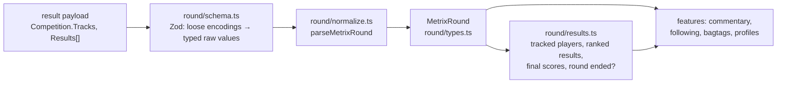

# Metrix integration

Everything the bot reads from [Disc Golf Metrix](https://discgolfmetrix.com) goes through
`MetrixClient` (`client.ts`). The client returns normalized types, or a result variant when
something fails. It never throws, and nothing outside this folder builds a Metrix URL or reads a
raw payload.

| Method | Source | Returns |
| --- | --- | --- |
| `getRound(roundId)` | `api.php?content=result&id=` (JSON) | `RoundFetchResult`: `fetched` with a `MetrixRound`, `invalid`, or `unavailable` |
| `getCourseDetails(courseId)` | `api.php?content=course&id=&code=` (JSON; needs `BOT_METRIX_INTEGRATION_CODE`) | `found` with `CourseDetails`, `failed`, or `unconfigured` without the code |
| `getCourseStatistics(courseId)` | the public course page `/course/<id>` (HTML, scraped) | `found` with `CourseStatistics`, `not-found` when the table is missing, or `failed` |
| `findCourseLocation(courseId, courseName)` | `api.php?content=courses_list&country_code=&name=` (JSON) | `found` with a `CourseLocation`, `not-found`, or `failed` |

Each endpoint's folder (`round/`, `course/`, `location/`, `statistics/`) has a `schema.ts` with its
Zod schemas and an example of what Metrix sends, with the fields the bot ignores marked `// ignored`.
The course page is HTML, so its example is the statistics parsed from it.

## The round

`parseMetrixRound` takes the raw payload in three steps:
1. `round/schema.ts` validates it with Zod and accepts Metrix's loose encodings.
2. Each player's `PlayerResults` is parsed into a `Scorecard`.
3. Each player is normalized: round status, standing and totals.

A payload it can't trust throws `ValidationError`, which the client reports as `invalid`. An
event or series throws `UnsupportedRoundError`.

### What Metrix sends, and what the bot makes of it

| Metrix sends | Normalized to | Where |
| --- | --- | --- |
| numbers as numbers or numeric strings (`"3"`, `"-1"`, `"+2"`) | integers | `schema.ts` `integerSchema` |
| `""`, `null` or a missing field for an unknown number | `null` | `schema.ts` `optionalIntegerSchema` |
| `Date` (`"2026-05-01"`) | `day`; `null` unless it is a real calendar date (`z.iso.date()`), and the round is still followed | `schema.ts` |
| `Time` (`"06:00:00"`), with `Date` | `startsAt`: local time in `METRIX_TIME_ZONE` (`Europe/Helsinki`), DST from the round's day; the day's 00:00 when `Time` is missing or not a clock time; `null` without a `day` | `schema.ts`, `normalize.ts` `roundStart` |
| `SubCompetitions` or `HasSubcompetitions` (an event or series), or no `Tracks` | `UnsupportedRoundError`; only single rounds are followed | `normalize.ts` |
| `Tracks[].NumberAlt` (e.g. `"10A"`) | the hole label, else the hole `Number`; duplicate labels are rejected | `normalize.ts` |
| `PlayerResults` entry `[]` | `null`: hole not recorded yet | `schema.ts` `scorecardSchema` |
| `PlayerResults` `null` or `[]` | `Scorecard { kind: "unavailable" }` | `normalize.ts` `parseScorecard` |
| `PlayerResults` with a different length from `Tracks` | `Scorecard { kind: "unavailable" }`, and it doesn't count when places are derived | `normalize.ts` `matchLayout` |
| hole `Result` | `strokes`, a positive integer | `schema.ts` |
| hole `Diff` empty or missing | `relativeToPar: null`; totals that need it stay unknown | `schema.ts` |
| hole `PEN` and/or `OB` | one `obCount`; when both are sent they must agree | `schema.ts` |
| `DNF` as `"1"`, `1`, `true` or `"DNF"` (`"0"`, `0`, `false`, `""` or none: finished) | `round.status: "dnf"` and no place | `schema.ts`, `normalize.ts` |
| no completion flag at all | a full card without DNF → `round.status: "complete"`, else `"active"` | `normalize.ts` `resolveRoundStatus` |
| `OrderNumber` 0 or missing (ties, and many players early in a round) | a shared place from recorded card totals, per division | `normalize.ts` `rankByRecordedTotals` |
| `OrderNumber` larger than the division's field | no place | `normalize.ts` `resolvePosition` |
| `PreviousRoundsSum`/`PreviousRoundsDiff`, or `ShowPreviousRoundsSum` | the standing is provisional: it includes earlier rounds | `normalize.ts` |
| `UserID` 0 (unregistered player) | `sourceId: null` | `normalize.ts` |
| `Sum`, `Diff` | `totalStrokes`, `totalRelativeToPar`; null until Metrix reports them | `normalize.ts` |
| `Errors` non-empty, or a different `ID` | `ValidationError` / `Error` | `schema.ts`, `normalize.ts` |

### The normalized model (`round/types.ts`)

- **`MetrixRound`**: id, name, `day` and `startsAt` (see above), course name and id, `holeLabels` in
  layout order, `players`.
  `layoutKey` changes when the course name or holes change, so stored progress can be reset.
- **`RoundPlayer`**: name, division, group, `scorecard`, `round`, `standing`, Metrix's own totals.
- **`Scorecard`**: `unavailable`, or `available` with one `HoleScore | null` per layout hole.
- **`HoleScore`**: `strokes`, `relativeToPar` (or null), `obCount` (or null).
- **`RoundState`**: `totalHoles` and `status` (`active`, `complete`, `dnf`; `unknown` only outside the parser).
- **`Standing`**: `position` (shared by ties; null for DNF or unknown), `fieldSize`, `isProvisional`.
- **`TrackedRoundPlayer`**: a round player matched to a player the chat follows (`players.id`).

`round/results.ts` answers the questions asked of a round:
- `trackRoundPlayers`: which players does the chat follow? The match is by name, ignoring case and
  surrounding space (`isSamePlayerName`), and must be unique.
- `hasTrackedRoundEnded`: has every tracked player finished or DNF'd?
- `selectRankedResults`: the results list.
- `selectFinalScores`: the totals to save.
- `finalTotals`, `completedRoundStrokes`: a player's totals, from Metrix or summed from a complete card.

## Course data

All three parts are optional: Metrix layouts are community-edited, and any field can be missing.

- **`CourseDetails`** (`course/courseDetails.ts`):
  - the layout's coordinates
  - the rating anchors (`RatingValue1/2`, `RatingResult1/2`; rating = linear through them)
  - per hole: label, par, length and tee/basket coordinates

  Feet are converted to metres. Coordinates at 0,0 or out of range count as missing. The
  integration code is redacted from any error text.
- **`CourseStatistics`** (`statistics/courseStatistics.ts`): from the course page's hidden
  `hole-stats-table-container` table, per hole:
  - par
  - average strokes
  - difficulty rank (1 = easiest)
  - result counts (aces … worse)

  A page without that table is `not-found`. An unexpected table is `failed`, never a guess.
- **`CourseLocation`** (`location/courseLocation.ts`): Metrix names layouts `Parent → Layout`, and a
  layout sits at its parent course. The course list is searched by the parent name; the country code
  is uppercased, because Metrix matches it case-sensitively. The round's own course entry is
  preferred, then an active parent course with the same name.
